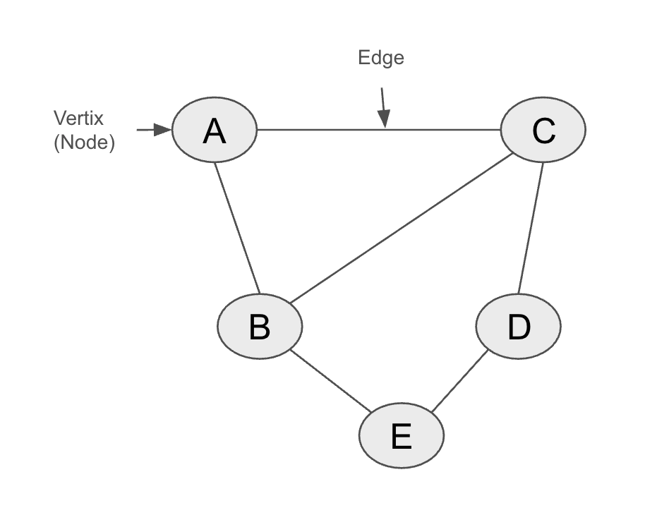
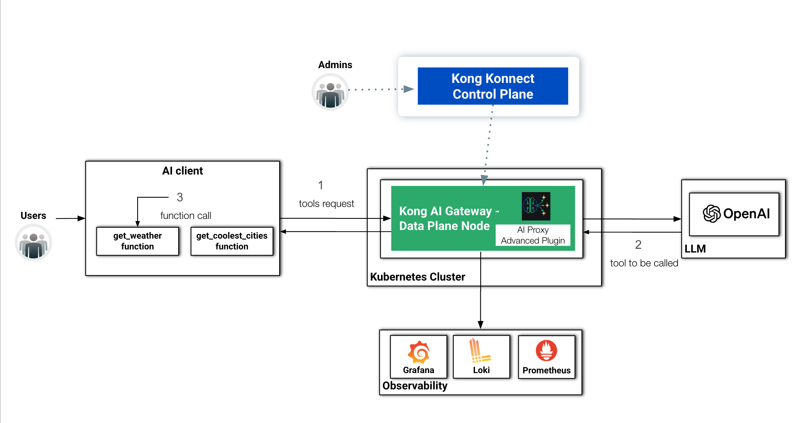
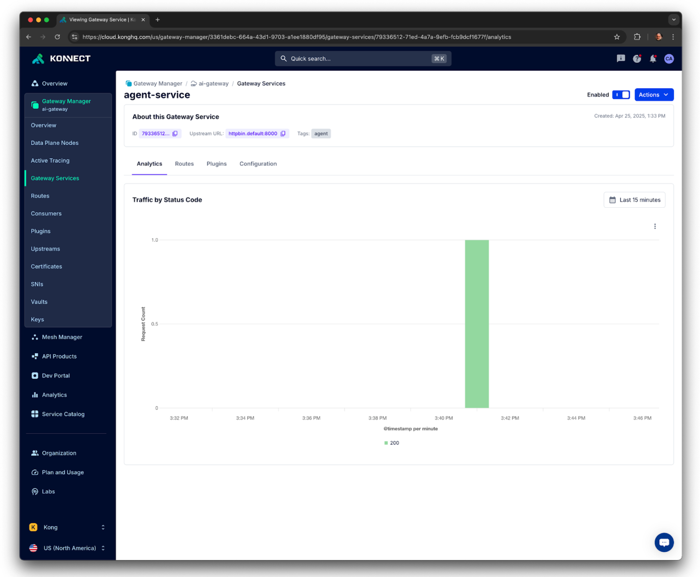
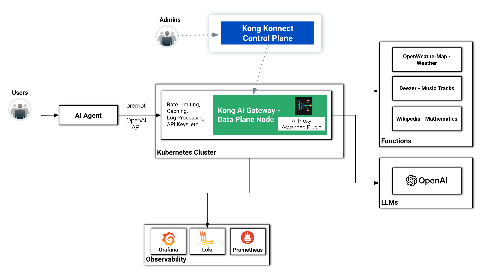
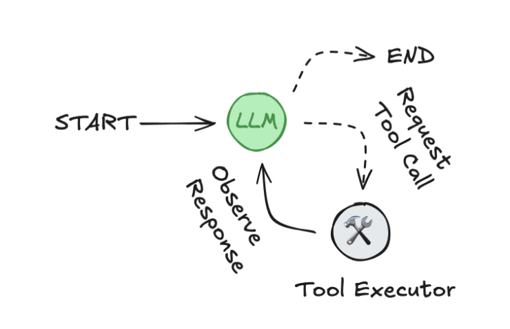
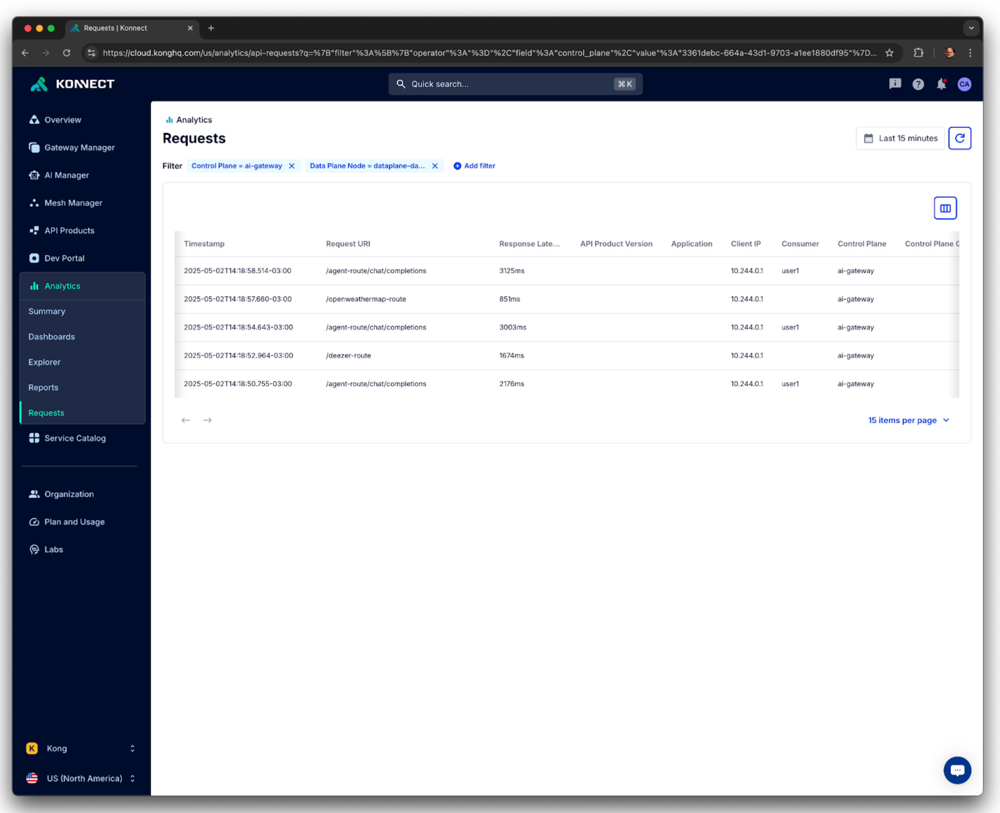

# How to Build a Single LLM AI Agent with Kong AI Gateway and LangGraph

In my previous post, we discussed how we can implement a basic AI Agent with Kong AI Gateway. In this part II of this series we are going to review LangGraph fundamentals, rewrite the AI Agent and explore how Kong AI Gateway can be used to protect an LLM infrastructure as well as external functions.


## LangGraph fundamentals

As you can see, our Agent was written using the OpenAI package only. It's a nice approach if you want to see a “raw” Agent in action. However, for several reasons, you should consider writing Agents taking advantage of some framework. For example: AI Agent complexity, security, integration with external systems and environments, not to mention development time, will rapidly become a necessity. To help you out, currently, the marketplace offers several AI Agent framework options including LlamaIndex, AutoGen, CrewAI, [LangGraph](https://www.langchain.com/langgraph), etc. 

We've seen a lot of traction around LangGraph so it'd be, at least, interesting to take a look at it, and how Kong AI Gateway can play with it.


### LangGraph and LangChain

[LangChain](https://python.langchain.com/docs/introduction/) provides a standard interface to interact with LLMs and other components, useful for straight-forward chains and retrieval flows. LangGraph is a framework for AI Agents and it is more low-level and controllable than LangChain constructs. It's totally licit working with LangGraph and not using LangChain classes.


### OpenAI RESTful request

So, let's get started with a fundamental and basic application exploring the main LangGraph concepts as described in this [LangGraph Glossary](https://langchain-ai.github.io/langgraph/concepts/low_level/) page. Note this is not a full Agent implementation but a code where we start using the LangGraph constructs to build a basic graph.

The first LangGraph script is based on this very simple OpenAI RESTful request. Make sure you've set the OPENAI_API_KEY environment variable with your OpenAI API Key.


```
curl https://api.openai.com/v1/chat/completions \
  -H "Content-Type: application/json" \
  -H "Authorization: Bearer $OPENAI_API_KEY" \
  -d '{
    "model": "gpt-4",
    "messages": [
      {
        "role": "user",
        "content": "What''s the longitude and latitude of Seattle"
      }
    ]
  }'
```


You should get a result similar to this:


```
{
  "id": "chatcmpl-BO3x47lZx2TLcgGsgLx7rGchcIB9m",
  "object": "chat.completion",
  "created": 1745074762,
  "model": "gpt-4-0613",
  "choices": [
    {
      "index": 0,
      "message": {
        "role": "assistant",
        "content": "The latitude and longitude of Seattle, Washington, USA is approximately 47.6062° N, 122.3321° W.",
        "refusal": null,
        "annotations": []
      },
      "logprobs": null,
      "finish_reason": "stop"
    }
  ],
  "usage": {
    "prompt_tokens": 14,
    "completion_tokens": 29,
    "total_tokens": 43,
    "prompt_tokens_details": {
      "cached_tokens": 0,
      "audio_tokens": 0
    },
    "completion_tokens_details": {
      "reasoning_tokens": 0,
      "audio_tokens": 0,
      "accepted_prediction_tokens": 0,
      "rejected_prediction_tokens": 0
    }
  },
  "service_tier": "default",
  "system_fingerprint": null
}
```


### LangGraph Python Script

The LangGraph Python Script equivalent to the request would look like the following:


```
from typing import TypedDict
from langgraph.graph import StateGraph, START, END

class State(TypedDict):
    messages: str
    response: str

def node_1(state: State) -> State:
    completions = client.chat.completions.create(
        model="gpt-4",
        messages=state["messages"]
    )
    return {"response": completions.choices[0].message.content}

builder = StateGraph(State)
builder.add_node("node_1", node_1)
builder.add_edge(START, "node_1")
builder.add_edge("node_1", END)

graph = builder.compile()
print(graph.get_graph().draw_ascii())

from openai import OpenAI
import os
client = OpenAI(
    api_key = os.getenv("OPENAI_API_KEY")
)

text = "What's the longitude and latitude of Seattle"
state = {"messages": [{"role": "user", "content": text}], "response": ""}

print("State before invoking the graph")
print(state)
print("-----\n")

print("Invoking the graph")
state = graph.invoke(state)
print("-----\n")

print("State after invoking the graph")
print(state)
print("-----\n")
```


Before executing it, make sure you have installed the following Python packages:


* `langgraph`
* `openai`

Now, you should see as a result:


```
+-----------+  
| __start__ |  
+-----------+  
      *        
      *        
      *        
  +--------+   
  | node_1 |   
  +--------+   
      *        
      *        
      *        
 +---------+   
 | __end__ |   
 +---------+   
State before invoking the graph
{'messages': [{'role': 'user', 'content': "What's the longitude and latitude of Seattle"}], 'response': ''}
-----

Invoking the graph
-----

State after invoking the graph
{'messages': [{'role': 'user', 'content': "What's the longitude and latitude of Seattle"}], 'response': 'The latitude and longitude of Seattle, Washington, USA is approximately 47.6062° N, 122.3321° W.'}
-----
```


### LangGraph main constructs

Richard J. Trudeau, in his seminal book [“Introduction to Graph Theory”](https://archive.org/details/introductiontogr0000trud), has a succinct graph definition: “A graph is an object consisting of two sets called its ‘vertex set’ and its ‘edge set’. The vertex set is a finite nonempty set. The edge may be empty, but otherwise its elements are two-element subsets of the vertex set.”. In other words, a graph is a data structure consisting of a set of vertices (also called nodes) connected by edges. Here's a graph with 5 vertices (nodes) and 6 edges:





*Basic graph with 5 vertices and 6 edges*

LangGraph fundamentally represents agents as graphs. The graphs are built using three main components:


* Nodes: fundamental unit of processing or decision-making within a graph.
* Edges: it determines which node should run next after a given node finishes executing.
* State: it is a structured data object that represents the current context of a graph.

Combining Nodes and Edges, you can construct agents that update the State as they run. As stated in the [LangGraph glossary page](https://langchain-ai.github.io/langgraph/concepts/low_level/#graphs): Nodes do the work. Edges tell what to do next.

Taking a look at our code, we have the following main constructs:


* [START](https://langchain-ai.github.io/langgraph/concepts/low_level/#start-node) and END nodes and constants: they represent the nodes that send user input to the graph and the terminal node.
* [State](https://langchain-ai.github.io/langgraph/concepts/low_level/#state) class:  it represents the state of the graph and consists of a schema (in our case, “messages” and “response”) and [reducer functions](https://langchain-ai.github.io/langgraph/concepts/low_level/#reducers), responsible for updating the graph status. In our case, we don't have any reducer function defined so LangGraph assumes that all updates to a key should override it. Optionally you can have reducer functions to add new values and not override the key, for example. The schema can be defined using Python's [TypedDict](https://mypy.readthedocs.io/en/stable/typed_dict.html) or [Pydantic](https://docs.pydantic.dev/latest/) models.
* [StateGraph](https://langchain-ai.github.io/langgraph/reference/graphs/#langgraph.graph.state.StateGraph) class: that's where you define and compile the graph with all nodes and edges. It returns a [CompiledStateGraph](https://langchain-ai.github.io/langgraph/reference/graphs/#langgraph.graph.state.CompiledStateGraph) object. The basic graph code does not have multiple nodes so it flows straightforwardly. In the next section, we are going to add “conditional edges” so it will control which node the next step of its processing should go to.
* The “[get_graph()](https://langchain-ai.github.io/langgraph/reference/graphs/#langgraph.graph.state.CompiledStateGraph.get_graph)” method returns [Graph](https://python.langchain.com/api_reference/core/runnables/langchain_core.runnables.graph.Graph.html#graph) object and its “draw_ascii()” method provides a convenient visual representation of the graph.
* [CompiledStateGraph.invoke()](https://langchain-ai.github.io/langgraph/reference/graphs/#langgraph.graph.state.CompiledStateGraph.invoke) method: since our graph does not have a loop, returning single output, the “invoke” method suffices. For ReAct AI Agent, where we have a reasoning loop, we should handle the graph execution differently. In the next section, implementing such a graph, will describe it.


## Tools and Function Calling

As you might have noticed that our simple AI Agent has a logic totally confined and self-contained into its code. Of course, the only external component called by the Agent is the GPT-4 model.

That, usually, becomes a huge restriction when we think about a bit more advanced agents. A mechanism to allow AI agents to invoke external functions, systems and API is necessary. That's the main purpose of Tools.

OpenAI, for instance, provides 4 classes of built-in [Tools](https://platform.openai.com/docs/guides/tools): Web Search, File Search, Computer Use and Function Calling. The latest is commonly used by agents to integrate and call external functionalities. As other examples, similar capabilities are provided by [Mistral](https://docs.mistral.ai/capabilities/function_calling/) and [Anthropic](https://docs.anthropic.com/en/docs/build-with-claude/tool-use/overview).


### OpenAI Built-In Tools

To illustrate how Tools and LLM models work together, let's send some requests to GPT-4. Let's say your AI Agent code has two functions defined:


* get_weather: returns weather information for a given city.
* get_composer: returns the composer of a specific piece.

The issue is that, depending on the prompt the AI Agent receives, it doesn't know which function it should call. So, the AI Agent sends a request to the LLM model and the response coming from it will drive the agent’s behaviour.

Here are some calls exemplifying the situation. The first request has in the “input” parameter the prompt received. In the “tools” parameter there's an array with the two functions with their respective descriptions. Let's see what happens when we send it:


```
curl -s https://api.openai.com/v1/responses \
-H "Content-Type: application/json" \
-H "Authorization: Bearer $OPENAI_API_KEY" \
-d '{
    "model": "gpt-4",
    "input": "Who wrote the Hungarian Rapsodies?",
    "tools": [
        {
            "type": "function",
            "name": "get_weather",
            "description": "Call to get the weather from a specific location.",
            "parameters": {
                "type": "object",
                "properties": {
                    "location": {
                        "type": "string",
                        "description": "City and country e.g. Bogotá, Colombia"
                    }
                },
                "required": [
                    "location"
                ],
                "additionalProperties": false
            }
        },
        {
            "type": "function",
            "name": "get_composer",
            "description": "Call to get the composer of a specific piece.",
            "parameters": {
                "type": "object",
                "properties": {
                    "piece": {
                        "type": "string",
                        "description": "Name of the composer of a classical piece e.g. Beethoven''s 5th Symphony"
                    }
                },
                "required": [
                    "piece"
                ],
                "additionalProperties": false
            }
        }
    ]
}' | jq '.output'
```


The “output” field has the following content. It instructs the AI Agent to call the function, with the specified arguments, to get a better response to the caller.


```
[
  {
    "id": "fc_680a9768943c81919427d5b9272bf31a0ad325331b90322b",
    "type": "function_call",
    "status": "completed",
    "arguments": "{\n  \"piece\": \"Hungarian Rhapsodies\"\n}",
    "call_id": "call_aotUalsZrtfqCxle0qaLgwFX",
    "name": "get_composer"
  }
]
```


## Tools and Function Calling, Kong Version with LangGraph and LangChain

With OpenAI's model still sitting behind the AI Gateway, let’s exercise a Python script sending Tools requests using LangGraph. You'll see the code also uses LangChain classes.

At the same time, from the Observability standpoint, it'd be interesting to check not just the requests and responses sent to and coming from the LLM model but also to explore the bodies that are going to be processed back and forth.

Here's the diagram showing the new components of our architecture:




*The basic architecture with a new Observability layer and LangGraph Tools*


### Observability Layer

Before working with the Kong Version for our Tools and Function Calling use cases, we are going to build an Observability layer to our environment. It will be comprised by:


* [Loki](https://grafana.com/oss/loki/): that's the most critical component, playing the log processing role and receiving all requests and responses processed by the Kong AI Gateway Data Plane.
* [Prometheus](https://prometheus.io/): responsible for scraping and storing the metrics the Kong AI Gateway will generate.
* [Grafana](https://grafana.com/oss/grafana/): used to query and analyze logs and metrics.


#### Installing Loki

First, all the Helm Charts


```
helm repo add grafana https://grafana.github.io/helm-charts
helm repo update
```


Install Loki with the following Helm command. Since we are exposing it with a Load Balancer, Minikube will start a new tunnel for the port 3100.


```
helm install loki -n loki grafana/loki-stack \
--create-namespace \
--set loki.image.tag=2.9.13 \
--set loki.service.type=LoadBalancer \
--set loki.service.port=3100 \
--set promtail.enabled=false
```


Hit the port to make sure Loki is ready to accept requests:


```
% http :3100/ready
HTTP/1.1 200 OK
Content-Length: 6
Content-Type: text/plain; charset=utf-8
Date: Fri, 25 Apr 2025 17:21:19 GMT
X-Content-Type-Options: nosniff

ready
```


If you want to uninstall it run:


```
helm uninstall loki -n loki
kubectl delete namespace loki
```


#### Installing Prometheus and Grafana

[https://managedkube.com/prometheus/operator/servicemonitor/troubleshooting/2019/11/07/prometheus-operator-servicemonitor-troubleshooting.html](https://managedkube.com/prometheus/operator/servicemonitor/troubleshooting/2019/11/07/prometheus-operator-servicemonitor-troubleshooting.html)

The Prometheus community distribution embeds Grafana so we can install both with a single command. Add the Helm Charts first:


```
helm repo add prometheus-community https://prometheus-community.github.io/helm-charts
```


Again, after the installation, we should have two new Minikube tunnels defined:


```
helm install prometheus -n prometheus prometheus-community/kube-prometheus-stack \
--create-namespace \
--set alertmanager.enabled=false \
--set prometheus.service.type=LoadBalancer \
--set prometheus.service.port=9090 \
--set grafana.service.type=LoadBalancer \
--set grafana.service.port=3000 \
--set prometheus.prometheusSpec.serviceMonitorSelectorNilUsesHelmValues=false
```


If you want to uninstall them run:


```
helm uninstall prometheus -n prometheus
kubectl delete namespace prometheus
```


By default, Grafana administrador's credentials are: `admin/prom-operator`

If you will, Kong provides Grafana dashboards for both API (id: 7424) and AI Gateways (ai: 21162)

In MacOS, you can open Grafana with:


```
open -a "Google Chrome" "http://localhost:3000"
```


#### Prometheus ServiceMonitor

The following declaration creates a [Prometheus ServiceMonitor](https://prometheus-operator.dev/docs/api-reference/api/#monitoring.coreos.com/v1.ServiceMonitor) to be used by Prometheus to get Kong metrics.


```
cat <<EOF | kubectl apply -f -
apiVersion: monitoring.coreos.com/v1
kind: ServiceMonitor
metadata:
  name: kong
  namespace: kong
  labels:
    app.kubernetes.io/name: kong
spec:
 selector:
   matchLabels:
     gateway-operator.konghq.com/dataplane-service-type: ingress
 endpoints:
 - targetPort: metrics
   scheme: http
 jobLabel: kong
 namespaceSelector:
   matchNames:
     - kong
EOF
```


If you want to delete it run:


```
kubectl delete servicemonitor kong -n kong
```


#### Kong Observability Plugins

Now, we need to configure the Kong Plugins that are going to generate the Observability signals the Data Plane will export to Prometheus and Loki.

The following deck declaration configures three Plugins. Check the documentation to learn more about them.


* [Prometheus](https://docs.konghq.com/hub/kong-inc/prometheus/): to get the Data Plane generating API and AI Gateway related metrics.
* [HTTP Log](https://docs.konghq.com/hub/kong-inc/http-log/): to push, as log entries, all requests that have been processed by the Data Plane. Loki requires a specific JSON format as you can see here ([https://grafana.com/docs/loki/latest/reference/loki-http-api/#ingest-logs](https://grafana.com/docs/loki/latest/reference/loki-http-api/#ingest-logs)) so we need to customize the HTTP Log plugin config to support that. That's what the Lua code, defined in the “custom_fields_by_lua” configuration parameter, does. Note that the plugin sends the requests to Loki using the Kubernetes Service FQDN.
* [Pre-Function](https://docs.konghq.com/hub/kong-inc/pre-function/): the plugin will inject the request and response bodies to the log entries before HTTPLog  plugin sends them to Loki.

Download the <code>[kong-agent-observability.yaml](https://raw.githubusercontent.com/CAcquaviva/kong-ai-gateway-langgraph/refs/heads/main/konnect/kong_agent_observability.yaml)</code> file with the declaration to configure the plugins. Some Lua functions used in the code configured in the HTTP Log and Pre-Function plugins require specific Data Plane configuration. As you may recall the Data Plane was deployed with the “untrusted_lua_sandbox_requires” parameter with those functions listed. You can apply the declaration with:


```
deck gateway sync --konnect-token $PAT ./kong-agent-observability.yaml
```


### Kong Version with LangGraph and LangChain

Now, let's explore the new Python Script where we use LangGraph and LangChain to exercise Tools and Function Calling, protected by Kong AI Gateway. Note that this is a code to test Tools and Function Calling. We are not actually implement an Agent:


```
from langchain_openai import ChatOpenAI
from langchain_core.tools import tool
from langgraph.prebuilt import ToolNode

kong_dp = "http://localhost:80"
agent_url = kong_dp + "/agent-route"

client = ChatOpenAI(base_url=agent_url, model="", api_key="dummy")

@tool
def get_weather(location: str):
    """Call to get the weather from a specific location."""
    if any([city in location.lower() for city in ["sf", "san francisco"]]):
        return "It's sunny in San Francisco, but you better look out if you're a Gemini 😈."
    else:
        return f"I am not sure what the weather is in {location}"

@tool
def get_coolest_cities():
    """Get a list of coolest cities"""
    return "nyc, sf"

tools = [get_weather, get_coolest_cities]
client = client.bind_tools(tools)

client_response = client.invoke("What's the weather in San Francisco?").tool_calls
print(client_response)
```


There are new and important abstractions in the code:


* We have changed the basic OpenAI class with LangChain's [ChatOpenAI](https://python.langchain.com/docs/integrations/chat/openai/). That's critical because this new class allows us to bind a collection of tools we have in our code. Note the constructor still refers to the same Kong Route.
* The code defines two functions as Tools: “get_weather” and “get_coolest_cities” using the “[@tool](https://python.langchain.com/api_reference/core/tools/langchain_core.tools.convert.tool.html)” decorator.
* The next three line are responsible for call the model as well as the available tools depending on the responses coming from the model
    * List of functions available

        ```
        tools = [get_weather, get_coolest_cities]
        ```


    * Bind the list to the client variable which has a reference to the LLM model

        ```
        client = client.bind_tools(tools)
        ```


    * Invoke the model with a prompt

        ```
        client_response = client.invoke("What's the weather in San Francisco?").tool_calls

        ```


After executing the code we can check two things:


* The actual response the Agent provides
* Use the Kong AI Gateway Observability layer to see the request sent to the LLM model and its respective response.

Here's the AI Agent response:


```
[{'name': 'get_weather', 'args': {'location': 'San Francisco'}, 'id': 'call_sK8reJDyzJ6JBeD8QqDpW9gK', 'type': 'tool_call'}]
```


That means the LLM Model took the prompt and returned saying the Agent should call the function “get_weather”, with the parameter ‘location’: ‘San Francisco’ to provide a better response to the caller.

Let's check Loki's log entries now. Here's the request sent by the Agent to the LLM model. As you can see it is quite similar to the one we sent previously using Curl. It has a “tools” section with the two functions defined in our code.


```
curl -G -s http://localhost:3100/loki/api/v1/query_range \
  --data-urlencode 'query={gateway="kong-gateway"}' | jq '.data.result[].values[0][1]' | jq fromjson | jq '.request.body'
{
  "stream": false,
  "model": "",
  "messages": [
    {
      "role": "user",
      "content": "What's the weather in San Francisco?"
    }
  ],
  "tools": [
    {
      "function": {
        "name": "get_weather",
        "parameters": {
          "properties": {
            "location": {
              "type": "string"
            }
          },
          "type": "object",
          "required": [
            "location"
          ]
        },
        "description": "Call to get the weather from a specific location."
      },
      "type": "function"
    },
    {
      "function": {
        "name": "get_coolest_cities",
        "parameters": {
          "properties": {},
          "type": "object"
        },
        "description": "Get a list of coolest cities"
      },
      "type": "function"
    }
  ]
}
```


Here’s the response the Agent got from the LLM model. As expected, it is instructing the Agent to call the “get_weather” function. The response coming from the Agent follows the instructions.


```
% curl -G -s http://localhost:3100/loki/api/v1/query_range \
  --data-urlencode 'query={gateway="kong-gateway"}' | jq '.data.result[].values[0][1]' | jq fromjson | jq '.response.body'
{
  "id": "chatcmpl-BQIPtyAVegfM3LoikCESdUDckDC6M",
  "choices": [
    {
      "index": 0,
      "message": {
        "content": null,
        "tool_calls": [
          {
            "id": "call_GYBQsc8M4PGetPEQK3pvfgqz",
            "type": "function",
            "function": {
              "name": "get_weather",
              "arguments": "{\n  \"location\": \"San Francisco\"\n}"
            }
          }
        ],
        "role": "assistant",
        "annotations": {},
        "refusal": null
      },
      "finish_reason": "tool_calls",
      "logprobs": null
    }
  ],
  "system_fingerprint": null,
  "created": 1745607021,
  "service_tier": "default",
  "model": "gpt-4-0613",
  "usage": {
    "prompt_tokens_details": {
      "audio_tokens": 0,
      "cached_tokens": 0
    },
    "total_tokens": 93,
    "completion_tokens_details": {
      "reasoning_tokens": 0,
      "accepted_prediction_tokens": 0,
      "audio_tokens": 0,
      "rejected_prediction_tokens": 0
    },
    "prompt_tokens": 76,
    "completion_tokens": 17
  },
  "object": "chat.completion"
}
```


You can check Kong Analytics dashboard, one more time, to see that only one request has been sent and processed.



*Kong Konnect Analytics*


#### Calling the actual Function

Let's replace the line of the Agent code where it sends the Tools request to the LLM model so it can accept the instructions from the LLM and call the actual “get_weather” function.

Change the following line


```
client_response = client.invoke("What's the weather in San Francisco?").tool_calls
```


With these new ones. It's important to keep the line where we bind the functions to the client reference of the model.


```
client_response = client.invoke("What's the weather in San Francisco?")
print(client_response)
print("\n")

tool = ToolNode(tools)
response = tool.invoke({"messages": [client_response]})
```


Here's the Agent's response. The function is actually called by the “tool.invoke” line. The “client.invoke” line returns the right parameters to do so.

“client.invoke” returns:


```
content='' additional_kwargs={'tool_calls': [{'id': 'call_fP7aborYv4d08I86KtgpGGEI', 'function': {'arguments': '{\n  "location": "San Francisco"\n}', 'name': 'get_weather'}, 'type': 'function'}], 'refusal': None} response_metadata={'token_usage': {'completion_tokens': 17, 'prompt_tokens': 76, 'total_tokens': 93, 'completion_tokens_details': {'accepted_prediction_tokens': 0, 'audio_tokens': 0, 'reasoning_tokens': 0, 'rejected_prediction_tokens': 0}, 'prompt_tokens_details': {'audio_tokens': 0, 'cached_tokens': 0}}, 'model_name': 'gpt-4-0613', 'system_fingerprint': None, 'id': 'chatcmpl-BQImmdurzZOcBqq9FWHwUhw92UVoP', 'finish_reason': 'tool_calls', 'logprobs': None} id='run-0b6e1ced-c3b7-488b-80e8-5ad4a9b1e3f0-0' tool_calls=[{'name': 'get_weather', 'args': {'location': 'San Francisco'}, 'id': 'call_fP7aborYv4d08I86KtgpGGEI', 'type': 'tool_call'}] usage_metadata={'input_tokens': 76, 'output_tokens': 17, 'total_tokens': 93, 'input_token_details': {'audio': 0, 'cache_read': 0}, 'output_token_details': {'audio': 0, 'reasoning': 0}}
```


“tool.invoke” returns:


```
{'messages': [ToolMessage(content="It's sunny in San Francisco, but you better look out if you're a Gemini 😈.", name='get_weather', tool_call_id='call_fP7aborYv4d08I86KtgpGGEI')]}
```


#### Sending a prompt with no function related

If we send a request with a prompt not related to any function description, the LLM responds as a regular “message” request:

For example, change your “client.invoke” line to:


```
client_response = client.invoke("Tell me about Fermat's last theorem")
```


Here's the AI Agent response. Since there's no appropriate function to satisfy the request, the LLM processes the request.


```
content="Fermat's Last Theorem is a statement in number theory that was first proposed by Pierre de Fermat in 1637. The theorem states that no three positive integers a, b, and c can satisfy the equation a^n + b^n = c^n for any integer value of n greater than two.\n\nWhile the cases n=1 and n=2 have been known to have infinitely many solutions since antiquity, Fermat claimed that he had a proof for all n, but he never revealed it. For hundreds of years, the theorem puzzled mathematicians, and it became one of the most famous unsolved problems in mathematics.\n\nThe theorem was finally proven by British mathematician Andrew Wiles in 1994. The proof is highly complex and uses many techniques from different areas of mathematics, some of which were not even invented until centuries after Fermat's death. Fermat's Last Theorem has few direct implications in everyday life, but the journey to its proof has led to substantial developments in number theory and algebraic geometry." additional_kwargs={'refusal': None} response_metadata={'token_usage': {'completion_tokens': 210, 'prompt_tokens': 76, 'total_tokens': 286, 'completion_tokens_details': {'accepted_prediction_tokens': 0, 'audio_tokens': 0, 'reasoning_tokens': 0, 'rejected_prediction_tokens': 0}, 'prompt_tokens_details': {'audio_tokens': 0, 'cached_tokens': 0}}, 'model_name': 'gpt-4-0613', 'system_fingerprint': None, 'id': 'chatcmpl-BQJ1oJWYwOdFDnS0X2i6E0JAcyAIv', 'finish_reason': 'stop', 'logprobs': None} id='run-48a213c1-92e3-44f2-b071-48a76ca1177e-0' usage_metadata={'input_tokens': 76, 'output_tokens': 210, 'total_tokens': 286, 'input_token_details': {'audio': 0, 'cache_read': 0}, 'output_token_details': {'audio': 0, 'reasoning': 0}}

{'messages': []}
```


And here are the request and response bodies:


```
% curl -G -s http://localhost:3100/loki/api/v1/query_range \
  --data-urlencode 'query={gateway="kong-gateway"}' | jq '.data.result[].values[0][1]' | jq fromjson | jq '.request.body' 
{
  "stream": false,
  "model": "",
  "messages": [
    {
      "role": "user",
      "content": "Tell me about Fermat's last theorem"
    }
  ],
  "tools": [
    {
      "function": {
        "name": "get_weather",
        "parameters": {
          "properties": {
            "location": {
              "type": "string"
            }
          },
          "type": "object",
          "required": [
            "location"
          ]
        },
        "description": "Call to get the weather from a specific location."
      },
      "type": "function"
    },
    {
      "function": {
        "name": "get_coolest_cities",
        "parameters": {
          "properties": {},
          "type": "object"
        },
        "description": "Get a list of coolest cities"
      },
      "type": "function"
    }
  ]
}

% curl -G -s http://localhost:3100/loki/api/v1/query_range \
  --data-urlencode 'query={gateway="kong-gateway"}' | jq '.data.result[].values[0][1]' | jq fromjson | jq '.response.body'
{
  "id": "chatcmpl-BQJ1oJWYwOdFDnS0X2i6E0JAcyAIv",
  "choices": [
    {
      "index": 0,
      "message": {
        "annotations": {},
        "content": "Fermat's Last Theorem is a statement in number theory that was first proposed by Pierre de Fermat in 1637. The theorem states that no three positive integers a, b, and c can satisfy the equation a^n + b^n = c^n for any integer value of n greater than two.\n\nWhile the cases n=1 and n=2 have been known to have infinitely many solutions since antiquity, Fermat claimed that he had a proof for all n, but he never revealed it. For hundreds of years, the theorem puzzled mathematicians, and it became one of the most famous unsolved problems in mathematics.\n\nThe theorem was finally proven by British mathematician Andrew Wiles in 1994. The proof is highly complex and uses many techniques from different areas of mathematics, some of which were not even invented until centuries after Fermat's death. Fermat's Last Theorem has few direct implications in everyday life, but the journey to its proof has led to substantial developments in number theory and algebraic geometry.",
        "refusal": null,
        "role": "assistant"
      },
      "finish_reason": "stop",
      "logprobs": null
    }
  ],
  "system_fingerprint": null,
  "created": 1745609372,
  "service_tier": "default",
  "model": "gpt-4-0613",
  "usage": {
    "total_tokens": 286,
    "prompt_tokens_details": {
      "audio_tokens": 0,
      "cached_tokens": 0
    },
    "prompt_tokens": 76,
    "completion_tokens_details": {
      "audio_tokens": 0,
      "rejected_prediction_tokens": 0,
      "reasoning_tokens": 0,
      "accepted_prediction_tokens": 0
    },
    "completion_tokens": 210
  },
  "object": "chat.completion"
}
```


### Kong AI Gateway plugins

As we'd mentioned previously, one of main responsibilities of the Kong AI Gateway is to implement and enforce policies to make the upstream services, in our case the LLM models, are being consumed properly.

As an example, the next declaration enables two plugins:


* [Key Auth](https://docs.konghq.com/hub/kong-inc/key-auth/): to implement an API Key security mechanism.
* [AI Rate Limiting Advanced](https://docs.konghq.com/hub/kong-inc/ai-rate-limiting-advanced/): to implement a rate limiting policies based on tokens sent to the LLM model.


#### decK declaration

The "kong_agent_simple_plugins.yaml” has the new decK declaration:


```
cat > kong_agent_simple_plugins.yaml << 'EOF'
_format_version: "3.0"
_info:
  select_tags:
  - agent
_konnect:
  control_plane_name: ai-gateway
services:
- name: agent-service
  host: localhost
  port: 32000
  routes:
  - name: agent-route1
    paths:
    - /agent-route
    plugins:
    - name: ai-proxy-advanced
      instance_name: "ai-proxy-advanced-openai-agent"
      enabled: true
      config:
        targets:
        - auth:
            header_name: "Authorization"
            header_value: "Bearer <your_OPENAI_API_KEY>"
          route_type: "llm/v1/chat"
          model:
            provider: "openai"
            name: "gpt-4"
    - name: key-auth
      instance_name: key-auth1
      enabled: true
consumers:
- keyauth_credentials:
  - key: "123456"
  username: user1
  plugins:
  - name: ai-rate-limiting-advanced
    instance_name: ai-rate-limiting-advanced-consumer1
    enabled: true
    config:
      llm_providers:
      - name: openai
        window_size:
        - 60
        limit:
        - 800
EOF
```


The declaration applies the two new plugins, AI Rate Limiting Advanced and Key Auth, and creates a [Kong Consumer](https://docs.konghq.com/gateway/latest/key-concepts/consumers/) with an API Key. You can submit the declaration the same way you did before:


```
deck gateway sync --konnect-token $PAT ./kong_agent_simple_plugins.yaml
```


You have to change the ChatOpenAI constructor line adding the API Key defined to protect the Kong Route. The new constructor uses the “default_headers” parameter to do so as described in the [ChatOpenAI documentation](https://python.langchain.com/api_reference/community/chat_models/langchain_community.chat_models.openai.ChatOpenAI.html):


```
client = ChatOpenAI(base_url=agent_url, model="", api_key="dummy", default_headers={"apikey": "123456"})
```


If you don't change this line the code will get a 401 error code, saying that, since the request doesn't have an API Key, you are unauthorized to consume the Kong Route. Moreover, if you execute the code several times, eventually you are going to get a 429 error code, meaning your Kong Consumer has reached the rate limiting policy threshold of 800 tokens per 60 seconds.


## LangGraph ReAct AI Agent with Tools

Now that we are a bit more familiar with Tools and Function Calling, we are going to enhance our LangGraph AI Agent and add the same Tools. Here's the new topology:





*Reference Architecture with external functions getting protected by the Kong AI Gateway*

Although using the same LangGraph framework, the original version of the Agent does not implement a reasoning loop. That is, when invoked, simply executes the Node which sends a request to the LLM and gets the results.This version implements a full ReAct Agent with a reasoning loop. Moreover, it reaches out to the LLM models through Kong AI Gateway.

Here are the main steps of the Agent:


1. Think about the input.
2. Choose a tool (action).
3. Act by invoking the tool.
4. Observe the result.
5. Repeat until it reaches a final answer.

The LangGraph documentation has a [page](https://langchain-ai.github.io/langgraph/agents/agents/) where it describes an Agent with the main components.





### The Code

Here's our new Agent:


```
from typing import Annotated, TypedDict
from langgraph.graph import StateGraph, START, END
from langchain_core.messages import BaseMessage
from langchain_core.messages import SystemMessage
from langgraph.graph.message import add_messages
from langchain_openai import ChatOpenAI
from langchain_core.tools import tool
from langgraph.prebuilt import ToolNode

from langchain_community.utilities.openweathermap import OpenWeatherMapAPIWrapper
import httpx

class State(TypedDict):
    messages: Annotated[list[BaseMessage], add_messages]

@tool
def get_weather(location: str):
    """Call to get the weather from a specific location."""
    openweathermap_url = kong_dp + "/openweathermap-route"
    result = httpx.get(openweathermap_url, params={"q": location})
    return result.json()

@tool
def get_composer(piece: str):
    """Call to get the composer of a specific piece."""
    deezer_url = kong_dp + "/deezer-route"
    result = httpx.get(deezer_url, params={"q": piece})
    return result.json()["data"][0]["artist"]["name"]

@tool
def get_mathematician(theorem: str):
    """Call to get the mathematician of a specific theorem."""
    wikipedia_url = kong_dp + "/wikipedia-route"
    result = httpx.get(wikipedia_url, params={"srsearch": theorem})
    return result.json()["query"]["search"][0]

def call_model(state: State):
    system_prompt = SystemMessage(
        "You are a helpful AI assistant, please convert temperatures to Celsius."
    )
    response = client.invoke([system_prompt] + state["messages"])
    return {"messages": [response]}

# Define the conditional edge that determines whether to continue or not
def should_continue(state: State):
    messages = state["messages"]
    last_message = messages[-1]
    # If there is no function call, then we finish
    if not last_message.tool_calls:
        return "end"
    # Otherwise if there is, we continue
    else:
        return "continue"

def print_stream(stream):
    for s in stream:
        message = s["messages"][-1]
        if isinstance(message, tuple):
            print(message)
        else:
            message.pretty_print()

tools = [get_weather, get_composer, get_mathematician]
tool_node = ToolNode(tools)

builder = StateGraph(State)
builder.add_node("agent_node", call_model)
builder.add_edge(START, "agent_node")
builder.add_node("tool_node", tool_node)
builder.add_conditional_edges('agent_node', should_continue, {"continue": "tool_node", "end": END})
builder.add_edge("tool_node", "agent_node")

graph = builder.compile()
print(graph.get_graph().draw_ascii())

kong_dp = "http://localhost:80"
agent_url = kong_dp + "/agent-route"

client = ChatOpenAI(base_url=agent_url, model="", api_key="dummy", default_headers={"apikey": "123456"})
client = client.bind_tools(tools)

text = "What's the weather in the city where the composer of 'Like a Rolling Stone' was born?"

print("start streaming the graph")
inputs = {"messages": [("user", text)]}
print_stream(graph.stream(inputs, stream_mode="values"))
print("stop streaming the graph")
```


### The Graph

The main difference we've added to this new Agent version is the graph itself. First, if you check the “print(graph.get_graph().draw_ascii())” code line result you'll see a different visual representation like this.


```
            +-----------+
            | __start__ |
            +-----------+
                  *
                  *
                  *
           +------------+
           | agent_node |
           +------------+
           ...         ...
          .               .
        ..                 ..
+-----------+           +---------+
| tool_node |           | __end__ |
+-----------+           +---------+
```


To better understand what's going on, maybe we should dissect the graph definition snippet:


* Fundamentally, the graph definition starts with the same three lines. Since it's associated with the “call_model” function, the “agent_node”, just like our first Agent version, is responsible for sending requests to the LLM model. It also defines a “[normal edge](https://langchain-ai.github.io/langgraph/concepts/low_level/#normal-edges)”, linking the START and “agent_node” nodes.


```
builder = StateGraph(State)
builder.add_node("agent_node", call_model)
builder.add_edge(START, "agent_node")

```


* Then it creates another node, named “tool_node”, associated with the “tool_nodes” variable, which is an array of all Tools’ functions (“get_weather”, “get_composer” and “get_mathematician”)


```
builder.add_node("tool_node", tool_node)

```


* In the next line, we add a new LangGraph construct, a “[conditional edge](https://langchain-ai.github.io/langgraph/concepts/low_level/#conditional-edges)”. That's where the agent makes decisions to determine which node should be processed next. The parameters required are:
    * The starting node, in this case, “agent_node”
    * The function that will determine which node should be called next. In our case, the “should_continue” function.
    * A mapping relating the function's outputs to actual graph nodes. If the function returns “continue” the next node will be “toll_node”, otherwise the graph will be routed to the END node and will finish.


```
builder.add_conditional_edges('agent_node', should_continue, {"continue": "tool_node", "end": END})

```


* The following and last line adds the second “edge”, saying the “tool_node” is associated with the “agent” node. That is necessary to get the graph loop in place.


```
builder.add_edge("tool_node", "agent_node")
```


The “should_continue” function is straightforward. It checks if the last response coming from the LLM was related to a Tools request. If it was, that means the graph should continue, returning to the “tool_node”, and call another Tool, as instructed in the LLM response. Otherwise, the loop will end.

As a last comment, the “call_model” function adds a SystemMessage to the request asking the LLM to convert any temperature it gets to Celsius.


### Graph Stream

Our first graph was very simple, with a single node and no reasoning loop. As you can check, the line “state = graph.invoke(state)” invokes the graph and gets the new State with the response returned by the graph.

This time, our graph does implement a loop so we need to handle the graph execution in a different way. You can still invoke the graph the same we did before. However, a more interesting way is to use the [CompiledStateGraph.stream](https://langchain-ai.github.io/langgraph/reference/graphs/#langgraph.graph.state.CompiledStateGraph.stream) method instead. What this new method does is stream the graph steps with the responses coming from the graph loop. The code is using the “stream_mode” as “values” which emits all values in the state after each step.

Streaming the graph should generate a very helpful output like this. Note it describes the different kinds of message the graph deals with: “Human Message”, “Ai Message” (coming from the LLM) and “Tool Message” coming from the Tools.


```
start streaming the graph
================================ Human Message =================================

What's the weather in the city where the composer of 'Like a Rolling Stone' was born?
================================== Ai Message ==================================
Tool Calls:
  get_composer (call_EhAHCD9CqwLbKNiRWM7go0BS)
 Call ID: call_EhAHCD9CqwLbKNiRWM7go0BS
  Args:
    piece: Like a Rolling Stone
================================= Tool Message =================================
Name: get_composer

Bob Dylan
================================== Ai Message ==================================

Bob Dylan was born in Duluth, Minnesota. Let's find out the weather.
Tool Calls:
  get_weather (call_L6jl2wlo6Ruf0hEK8h3ddaI1)
 Call ID: call_L6jl2wlo6Ruf0hEK8h3ddaI1
  Args:
    location: Duluth, Minnesota
================================= Tool Message =================================
Name: get_weather

{"coord": {"lon": -92.1066, "lat": 46.7833}, "weather": [{"id": 804, "main": "Clouds", "description": "overcast clouds", "icon": "04d"}], "base": "stations", "main": {"temp": 278.12, "feels_like": 275.96, "temp_min": 276.86, "temp_max": 280.56, "pressure": 1016, "humidity": 91, "sea_level": 1016, "grnd_level": 982}, "visibility": 10000, "wind": {"speed": 2.57, "deg": 100}, "clouds": {"all": 100}, "dt": 1746213924, "sys": {"type": 2, "id": 2086417, "country": "US", "sunrise": 1746183078, "sunset": 1746235157}, "timezone": -18000, "id": 5024719, "name": "Duluth", "cod": 200}
================================== Ai Message ==================================

The temperature in Duluth, Minnesota, where Bob Dylan was born, is currently 278.12 Kelvin. Let's convert that to Celsius.

The formula to convert from Kelvin to Celsius is: C = K - 273.15

So, 278.12 Kelvin is approximately 5 degrees Celsius.
stop streaming the graph
```


You can check the requests processed by the Gateway using the Observability layer or the Analytics capabilities provided by Konnect UI. For example, here are the requests related to the AI Agent:





### The State

Another relevant change of the code is the AI Agent State. Differently from the first agent, the current State is defined as


```
class State(TypedDict):
    messages: Annotated[list[BaseMessage], add_messages]
```


Fundamentally, the State has only one key, “message”, which is based on the “Annotated” type. The “Annotated” type specifies:


* A list of “[BaseMessage](https://python.langchain.com/api_reference/core/messages/langchain_core.messages.base.BaseMessage.html)” messages.
* The “[add_messages](https://langchain-ai.github.io/langgraph/reference/graphs/#langgraph.graph.message.add_messages)” reducer function to the State. Used in a StateGraph, “add_messages” function appends the messages received from LLM models and Tools.

Creating a State as a list of messages is [justifiable and helpful](https://langchain-ai.github.io/langgraph/concepts/low_level/#working-with-messages-in-graph-state) since we are managing multiple responses coming from LLM models and Tools. Moreover, the “Annotated” type could specify a list of regular strings. However, “[BaseMessage](https://python.langchain.com/api_reference/core/messages.html)” class seems more appropriate because it is the base class for any other message classes we are going to deal with such as “HumanMessage” for user input or “AIMessage” for LLM response.


### The Tools

Each tool is calling an external service, in our case:


* “get_weather”: it calls the public [OpenWeather](https://openweathermap.org/city/2643743) service to get information about weather in a given location.
* “get_composer”: it relies on public [RapidAPI's Deezer](https://rapidapi.com/deezerdevs/api/deezer-1) service to manage composers of a given musical piece.
* “get_mathematician”: it sends requests to Wikipedia to get information about theorems.

The main point is that, as illustrated in the diagram, the endpoints related to the functions are also protected by Kong AI Gateway. That means we can leverage the capabilities the Gateway provides to implement policies.


### decK declaration

External service might require specific API keys to get called. As an example of a Gateway policy, and since it is sitting in front of the services it's easy to let it manage the API Keys. Here's the decK declaration for the three external service's endpoints:


```
_format_version: "3.0"
_info:
  select_tags:
  - agent
_konnect:
  control_plane_name: ai-gateway
services:
- name: openweathermap-service
  url: https://api.openweathermap.org/data/2.5/weather
  routes:
  - name: openweathermap-route
    paths:
    - /openweathermap-route
    plugins:
    - name: request-transformer
      instance_name: request-transformer-openweathermap
      config:
        add:
          querystring:
          - "appid:<your_openweathermap_api_key>"
- name: deezer-service
  url: https://deezerdevs-deezer.p.rapidapi.com/search
  routes:
  - name: deezer-route
    paths:
    - /deezer-route
    plugins:
    - name: request-transformer
      instance_name: request-transformer-deezer
      config:
        add:
          headers:
          - "x-rapidapi-key:<your_rapidapi_deezer_api_key>"
- name: wikipedia-service
  url: https://en.wikipedia.org/w/api.php
  routes:
  - name: wikipedia-route
    paths:
    - /wikipedia-route
    plugins:
    - name: request-transformer
      instance_name: request-transformer-wikipedia
      config:
        add:
          querystring:
          - "action:query"
          - "list:search"
          - "format:json"
- name: agent-service
  host: localhost
  port: 32000
  routes:
  - name: agent-route1
    paths:
    - /agent-route
    plugins:
    - name: ai-proxy-advanced
      instance_name: "ai-proxy-advanced-agent"
      enabled: true
      config:
        targets:
        - model:
            provider: "openai"
            name: "gpt-4"
          auth:
            header_name: "Authorization"
            header_value: "Bearer <your_openai_api_key>"
          route_type: "llm/v1/chat"
          logging:
            log_payloads: true
            log_statistics: true
    - name: key-auth
      instance_name: key-auth1
      enabled: true
consumers:
- keyauth_credentials:
  - key: "123456"
  username: user1
  plugins:
  - name: ai-rate-limiting-advanced
    instance_name: ai-rate-limiting-advanced-consumer1
    enabled: true
    config:
      llm_providers:
      - name: openai
        window_size:
        - 60
        limit:
        - 800
```


The declaration creates Kong Services and Kong Routes for each one of the external services. With the [Request Transformer](https://docs.konghq.com/hub/kong-inc/request-transformer/) plugin we inject the necessary API Key required by the external services. That provides a secure solution to manage API Keys. As we stated before, for production environments, we recommend leveraging Secrets Managers to store the keys.

Moreover, the Gateway abstracts, from the Agent perspective the endpoint addresses each external service exposes. That flexibility provides a transparency where any changes you might want to make to the external service doesn't impact the Agent.


### LangGraph reasoning

Taking a look at new Agent code, we can see that, In LangGraph, reasoning might happen in three different moments:


* Inside Nodes: it processes inputs and generates outputs based on prompts and intermediate state. This is what happened, for example, in our very first Agent where we used Prompt Engineering to state it should implement the ReAct pattern.
* Conditional Edges can model logical flows and decisions.
* States, acting as a memory, evolve as the graph progresses. Reasoning can involve reading from or writing to this state to keep track of thoughts, decisions, or partial results.

In part III we are going to evolve our AI Agent again to implement Semantic Routing across multiple LLMs infrastructures.