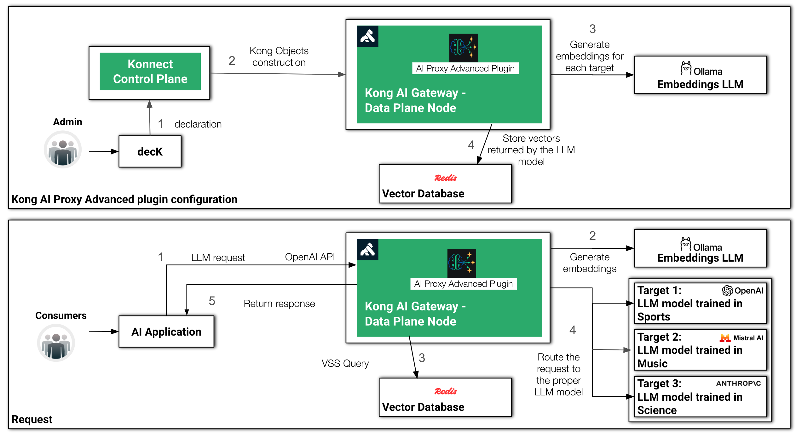

# How to Build a Multi-LLM AI Agent with Kong AI Gateway and LangGraph

In this third and final part of this series we are going to evolve the AI Agent with multiple LLMs and Semantic Routing policies across them. Moreover we will explore some new capabilities provided by Kong AI Gateway 3.11 to support other GenAI infrastructures.


## Multi-LLM ReAct AI Agent

In this section of the blog post we are going to evolve the architecture one more time to add two new LLMs infrastructures sitting behind the Gateway, besides OpenAI: Mistral and Anthropic.


### Multi-LLM scenarios and use cases

In the main scenario, the Agent needs to communicate to multiple LLMs selectively, depending on its needs. Having the Kong AI Gateway intermediating the communication provides several benefits:


* Decide which LLM to use based on the cost, latency times, reliability, and mainly on semantics (some LLMs are better at a specific topic, others at coding, etc).
* Route queries to the appropriate LLM(s).
* Act based on the results.
* Fallback and redundancy: If one LLM fails or is slow, use another.


### Semantic Routing Architecture

Kong AI Gateway offers a range of semantic capabilities including Caching and Prompt Guard. To implement the Multi-LLM Agent infrastructure we are going to use the Semantic Routing capability provided by the AI Proxy Advanced plugin we've been using for the entire post.

The AI Proxy Advanced Plugin has the ability to implement various load balancing policies, including distributing requests based on semantics or similarity between the prompts and description of each model. For example, consider that you have three models: the first one has been trained in sports, the second in music and the third one in science. What we want to do is route the requests accordingly based on the topic each prompt has presented.

What happens is that, during configuration time, done by, for example, submitting decK declarations to Konnect Control Plane, the plugin hits the embeddings model for each description and stores the embeddings into the Vector database.

Then, for each incoming request, the plugin submits a VSS (or Virtual Similarity Search) to the Vector Database to decide to which LLM the request should be routed to.





*Semantic Routing configuration and request processing times*


### Redis

To implement the Semantic Routing architecture we are going to use the [Redis-stack Helm Charts](https://github.com/redis-stack/helm-redis-stack) to Redis as our Vector Database.


```
helm repo add redis-stack https://redis-stack.github.io/helm-redis-stack
help repo update

helm install redis-stack redis-stack/redis-stack -n redis --create-namespace
```


### Ollama

As our Embedding model we are going to consumer the “mxbai-embed-large:latest” model handled locally by Ollama. Use the [Ollama Helm Charts](https://github.com/otwld/ollama-helm) to install it.


```
helm repo add ollama-helm https://otwld.github.io/ollama-helm/
helm repo update

helm install ollama ollama-helm/ollama \
-n ollama \
  --create-namespace \
  --set ollama.models.pull[0]="mxbai-embed-large:latest" \
  --set service.type=LoadBalancer
```


### Python Script

In this final AI Agent Python script we have two main changes:


* We have replaced the Tools with new functions:
    * “get_music”: consumes the [Event Registry](https://eventregistry.org/) service looking for music concerts.
    * “get_traffic”: it sends requests to [Tavily](https://tavily.com/) service for traffic information.
    * “get_weather”: it remains the same, related to the [OpenWeather](https://openweathermap.org) public service.
* Replaces the LangGraph calls to build the graph with another LangGraph pre-built function, “[create_react_agent](https://langchain-ai.github.io/langgraph/reference/agents/?h=create_react#langgraph.prebuilt.chat_agent_executor.create_react_agent)”.

The pre-built function “create_react_agent” is very helpful to implement the fundamental ReAct graph we created programmatically before. That is, the agent is composed by:


* A Node sending requests to the LLM
* A “conditional_edge” associated with this Node and making decisions about how the Agent should proceed when getting a response from the LLM.
* A Node to call Tools

In fact, if you print the output of the graph with “graph.get_graph().draw_ascii())” function again, you will see the same graph structure we had in the previous version of the agent.


```
from langgraph.prebuilt import create_react_agent
from langchain_openai import ChatOpenAI
from langchain_core.tools import tool
from langchain_community.utilities.openweathermap import OpenWeatherMapAPIWrapper
import httpx

@tool
def get_weather(location: str):
    """Call to get the weather from a specific location."""
    print("starting get_weather function")
    openweathermap_url = kong_dp + "/openweathermap-route"
    result = httpx.get(openweathermap_url, params={"q": location})
    print("finishing get_weather function")
    return result.json()

@tool
def get_music_concert(location: str):
    """Call to get the events in a given location."""
    print("starting get_music_concerts function")
    searchevent_url = kong_dp + "/searchevent-route"
    location = location.replace(" ", "_")
    data={
        "query": {
            "$query": {
                "$and": [
                    {
                        "categoryUri": "dmoz/Arts/Music/Bands_and_Artists"
                    },
                    {
                        "locationUri": f"http://en.wikipedia.org/wiki/{location}"
                    }
                ]
            },
            "$filter": {
                "forceMaxDataTimeWindow": "31"
            }
        },
        "resultType": "events",
        "eventsSortBy": "date",
        "eventImageCount": 1,
        "storyImageCount": 1
    }
    result = httpx.post(searchevent_url, json=data)
    print("finishing get_music_concert function")
    return result.json()["events"]["results"][0]["concepts"][0]["label"]["eng"]

@tool
def get_traffic(location: str):
    """Call to get the traffic situation of a given location."""
    print("starting get_traffic function")
    traffic_url = kong_dp + "/tavily-traffic-route"
    data={"query": f"Generally, what is the worst time of day for car traffic in {location}", "search_depth": "advanced"}
    result = httpx.post(traffic_url, json=data)
    print("finishing get_traffic function")
    return result.json()["results"][0]["content"]

tools = [get_weather, get_music_concert, get_traffic]

kong_dp = "http://127.0.0.1"
agent_url = kong_dp + "/agent-route"

client = ChatOpenAI(base_url=agent_url, model="", api_key="dummy", default_headers={"apikey": "123456"})

graph = create_react_agent(client, tools)
print(graph.get_graph().draw_ascii())

def print_stream(stream):
    for s in stream:
        message = s["messages"][-1]
        if isinstance(message, tuple):
            print(message)
        else:
            message.pretty_print()

inputs = {"messages": [("user", "In my next vacation, I'm planning to visit the city where Jimi Hendrix was born? Is there any music concert to see? Also provide weather and traffic information about the city")]}
print_stream(graph.stream(inputs, stream_mode="values"))
```


For this execution, the AI Proxy Advanced Plugin will route the request to Mistral, since it's related to music.


### decK Declaration

Below you can check the new decK declaration for the Semantic Routing use case. The AI Proxy Advanced plugin has the following sections configured:


* embeddings: where the plugin should go to generate embeddings related to the LLM models.
* vectordb: responsible for storing the embeddings and handling the VSS queries.
* targets: an entry for each LLM model. The most important setting is the “description” where we define where the plugin should route the requests to.

Besides, the declaration applies the [AI Prompt Decorator](https://docs.konghq.com/hub/kong-inc/ai-prompt-decorator/) plugin so the Gateway asks the LLM to convert temperatures to Celsius.


```
_format_version: "3.0"
_info:
  select_tags:
  - agent
_konnect:
  control_plane_name: ai-gateway
services:
- name: openweathermap-service
  url: https://api.openweathermap.org/data/2.5/weather
  routes:
  - name: openweathermap-route
    paths:
    - /openweathermap-route
    plugins:
    - name: request-transformer
      instance_name: request-transformer-openweathermap
      config:
        add:
          querystring:
          - "appid:<your_openweathermap_api_key>"
- name: searchevent-service
  url: https://eventregistry.org/api/v1/event/getEvents
  routes:
  - name: searchevent-route
    paths:
    - /searchevent-route
    plugins:
    - name: request-transformer
      instance_name: request-transformer-events
      config:
        add:
          body:
          - "apiKey:<your_event_search_api_key>"
- name: tavily-trafficservice
  url: https://api.tavily.com/search
  routes:
  - name: tavily-traffic-route
    paths:
    - /tavily-traffic-route
    plugins:
    - name: request-transformer
      instance_name: request-transformer-tavily-traffic
      config:
        add:
          headers:
          - "Authorization:Bearer <your_tavely_api_key>"
- name: agent-service
  host: httpbin.default
  port: 8000
  routes:
  - name: agent-route1
    paths:
    - /agent-route
    plugins:
    - name: ai-proxy-advanced
      instance_name: "ai-proxy-advanced-agent"
      enabled: true
      config:
        balancer:
          algorithm: semantic
        embeddings:
          model:
            provider: openai
            name: mxbai-embed-large
            options:
              upstream_url: "http://ollama.ollama:11434/v1/embeddings"
        vectordb:
          dimensions: 1024
          distance_metric: cosine
          strategy: redis
          threshold: 0.8
          redis:
            host: redis-stack.redis.svc.cluster.local
            port: 6379
        targets:
        - model:
            provider: "openai"
            name: "o3-mini"
          auth:
            header_name: "Authorization"
            header_value: "Bearer <your_openai_api_key>"
          route_type: "llm/v1/chat"
          description: "sports, soccer, football, basketball, beisebol"
          logging:
            log_payloads: true
            log_statistics: true
        - model:
            provider: "mistral"
            name: "mistral-large-latest"
            options:
              mistral_format: "openai"
              upstream_url: "https://api.mistral.ai/v1/chat/completions"
          auth:
            header_name: "Authorization"
            header_value: "Bearer <your_mistral_api_key>"
          route_type: "llm/v1/chat"
          description: "piano, orchestra, liszt, classical music, rock, pop music"
          logging:
            log_payloads: true
            log_statistics: true
        - model:
            provider: "anthropic"
            name: "claude-3-7-sonnet-20250219"
            options:
              anthropic_version: "2023-06-01"
              max_tokens: 200
          auth:
            header_name: "x-api-key"
            header_value: "<your_anthropic_api_key>"
          route_type: "llm/v1/chat"
          description: "science, physics, relativity theory, mathematics, algebra, calculus, trigonometry"
          logging:
            log_payloads: true
            log_statistics: true
   - name: ai-prompt-decorator
     instance_name: ai-prompt-decorator1
     enabled: true
     config:
       prompts:
         prepend:
         - role: system
           content: "You are a helpful AI assistant, please convert temperatures to Celsius."
   - name: key-auth
     instance_name: key-auth1
     enabled: true
consumers:
- keyauth_credentials:
  - key: "123456"
  username: user1
  plugins:
  - name: ai-rate-limiting-advanced
    instance_name: ai-rate-limiting-advanced-consumer1
    enabled: true
    config:
      llm_providers:
      - name: openai
        window_size:
        - 60
        limit:
        - 800
```


### Grafana Dashboards

Download and install the [Grafana Dashboard](https://github.com/CAcquaviva/kong-ai-gateway-langgraph/blob/main/grafana/Multi-LLM.json) available in the GitHub repository. It has two tiles:


* Counter of requests for each Kong Route.
* Counter of requests for each LLM model.

The dashboard is totally based on the metrics generated by the Prometheus plugin. The configuration is divided into two parts:


* AI Proxy Advanced plugin with the following parameters

        ```
         logging:
                    log_payloads: true
                    log_statistics: true
        ```


* Prometheus plugin with the parameter

    ```
    ai_metrics: true

    ```


<p id="gdcalert2" ><span style="color: red; font-weight: bold">>>>>>  gd2md-html alert: inline image link here (to images/image2.png). Store image on your image server and adjust path/filename/extension if necessary. </span><br>(<a href="#">Back to top</a>)(<a href="#gdcalert3">Next alert</a>)<br><span style="color: red; font-weight: bold">>>>>> </span></p>


*Grafana Dashboard based on the metrics generated by the Prometheus plugin*


## LangGraph Server

Now that we have our final version of the AI Agent it is time to build a [LangGraph Server](https://langchain-ai.github.io/langgraph/concepts/langgraph_server/) based on it. You have multiple [deployments](https://langchain-ai.github.io/langgraph/tutorials/deployment/#deployment-options) options to run your LangGraph Server but we are going to do in our own Minikube cluster in a deployment called “[Standalone Container](https://langchain-ai.github.io/langgraph/concepts/langgraph_standalone_container/)”

[https://langchain-ai.github.io/langgraph/cloud/reference/api/api_ref.html](https://langchain-ai.github.io/langgraph/cloud/reference/api/api_ref.html)

[https://github.com/langchain-ai/helm/blob/main/charts/langgraph-cloud/README.md](https://github.com/langchain-ai/helm/blob/main/charts/langgraph-cloud/README.md)


### Agent Docker Image

The first step is to create the Docker image for the Server. The code below removes the lines where we execute the graph. Another change is for the Kong Data Plane address, referring to the Kubernetes FQDN Service.


```
from langgraph.prebuilt import create_react_agent
from langchain_openai import ChatOpenAI
from langchain_core.tools import tool
from langchain_community.utilities.openweathermap import OpenWeatherMapAPIWrapper
import httpx

@tool
def get_weather(location: str):
    """Call to get the weather from a specific location."""
    print("calling get_weather function")
    openweathermap_url = kong_dp + "/openweathermap-route"
    result = httpx.get(openweathermap_url, params={"q": location})
    return result.json()

@tool
def get_music_concerts(location: str):
    """Call to get the events in a given location."""
    print("calling get_music_concerts function")
    searchevent_url = kong_dp + "/searchevent-route"
    location = location.replace(" ", "_")
    data={
        "query": {
            "$query": {
                "$and": [
                    {
                        "categoryUri": "dmoz/Arts/Music/Bands_and_Artists"
                    },
                    {
                        "locationUri": f"http://en.wikipedia.org/wiki/{location}"
                    }
                ]
            },
            "$filter": {
                "forceMaxDataTimeWindow": "31"
            }
        },
        "resultType": "events",
        "eventsSortBy": "date",
        "eventImageCount": 1,
        "storyImageCount": 1
    }
    result = httpx.post(searchevent_url, json=data)
    return result.json()["events"]["results"][0]["concepts"][0]["label"]["eng"]

@tool
def get_traffic(location: str):
    """Call to get the traffic situation of a given location."""
    print("calling get_traffic function")
    traffic_url = kong_dp + "/tavily-traffic-route"
    data={"query": f"Generally, what is the worst time of day for car traffic in {location}", "search_depth": "advanced"}
    result = httpx.post(traffic_url, json=data)
    return result.json()["results"][0]["content"]

tools = [get_weather, get_music_concerts, get_traffic]
#kong_dp = "http://127.0.0.1"
kong_dp = "http://proxy1.kong"
agent_url = kong_dp + "/agent-route"

client = ChatOpenAI(base_url=agent_url, model="", api_key="dummy", default_headers={"apikey": "123456"})

graph = create_react_agent(client, tools)
```


#### langgraph.json

The Docker image requires a “langgraph.json” file with the dependencies and the name of the graph variable inside the code, in our case “graph”.


```
{
  "dependencies": [
    ".",
    "langchain_openai",
    "langchain_community"
  ],
  "graphs": {
    "agent": "./langgraph_react_kong.py:graph"
  }
}
```


#### Docker image creation

Create the image with the [“langgraph” CLI](https://langchain-ai.github.io/langgraph/concepts/langgraph_cli/?h=langgraph+cli) command. It requires Docker installed in your environment.


```
langgraph build --platform linux/arm64 -t claudioacquaviva/langgraph-kong1
```


or


```
langgraph build --platform linux/amd64 -t claudioacquaviva/langgraph-kong1
```


Push it to Docker Hub:


```
docker push claudioacquaviva/langgraph-kong1
```


### Agent Deployment

Install your LangGraph Service using the Helm Chart available:


```
helm repo add langchain https://langchain-ai.github.io/helm/
```


The “values.yaml” defines the Service as “LoadBalancer” to make it available. Currently, only Postgres is supported as a database for LangGraph Server and Redis as the task queue. The file specifies Postgres resources for its Kubernetes deployment. Finally, LangGraph Server requires a [LangSmith](https://docs.smith.langchain.com/) API Key. LangSmith is a platform used to monitor your server. Log to [LangSmith](https://smith.langchain.com/) and create your API Key.


```
cat > values.yaml << 'EOF'
images:
  apiServerImage:
    pullPolicy: Always
    repository: claudioacquaviva/langgraph-kong1
    tag: latest

config:
  langGraphCloudLicenseKey: ""

studio:
  enabled: false

postgres:
  statefulSet:
    resources:
      limits:
        cpu: 500m
        memory: 1Gi
      requests:
        cpu: 500m
        memory: 1Gi

apiServer:
  service:
    type: LoadBalancer
    httpPort: 8090
  deployment:
    extraEnv:
      - name: LANGSMITH_API_KEY
        value: "<your_langsmith_api_key>"
EOF
```


Deploy the LangGraph Server:


```
helm install langgraph-cloud langchain/langgraph-cloud \
  -n langgraph \
  --create-namespace \
  --values values.yaml
```


If you want to uninstall it run:


```
helm uninstall langgraph-cloud -n langgraph
kubectl delete pvc data-langgraph-cloud-postgres-0 -n langgraph
```


### LangGraph Server API

If the LangGraph Server deployed you can use its [API](https://langchain-ai.github.io/langgraph/concepts/langgraph_server/#langgraph-server-api) to send requests to your graph:

Look for your assistants with:


```
% curl -s -X POST http://0.0.0.0:8090/assistants/search \
  --header 'Content-Type: application/json' \
  --data '{
  "metadata": {},
  "graph_id": "",
  "limit": 10,
  "offset": 0
}' | jq
```


The expected response is:


```
[
  {
    "assistant_id": "fe096781-5601-53d2-b2f6-0d3403f7e9ca",
    "graph_id": "agent",
    "created_at": "2025-04-28T15:26:37.723363+00:00",
    "updated_at": "2025-04-28T15:26:37.723363+00:00",
    "config": {},
    "metadata": {
      "created_by": "system"
    },
    "version": 1,
    "name": "agent",
    "description": null
  }
]
```


Use the assistant's name to invoke graph:


```
curl -s http://localhost:8090/runs/wait \
--header 'Content-Type: application/json' \
--data '{
    "assistant_id": "agent",
    "input": {
        "messages": [{"role": "user", "content": "In my next vacation, I''m planning to visit the city where Jimi Hendrix was born? Is there any music concert to see? Also provide weather and traffic information about the city."}]
    }
}' | jq -r '.messages[5].content'
```


Expected response


```
In Seattle, it is currently overcast with a temperature of 69.8°F (20.4°C) and feels like 68.9°F (20.5°C). The city has a humidity of 80% and wind speed of 4.12 mph from the west. There is a music concert of Phish happening in the city, but be aware that the worst period of travel is generally Thursday afternoons, especially 4-6 pm.
```


## Kong AI Gateway 3.11 and new GenAI models support

With Kong AI Gateway 3.11 we will be able to support other GenAI infrastructures besides LLMs, including video, images, etc. The following diagram lists the new modes supported:


<p id="gdcalert3" ><span style="color: red; font-weight: bold">>>>>>  gd2md-html alert: inline image link here (to images/image3.png). Store image on your image server and adjust path/filename/extension if necessary. </span><br>(<a href="#">Back to top</a>)(<a href="#gdcalert4">Next alert</a>)<br><span style="color: red; font-weight: bold">>>>>> </span></p>


For example, here is an example of a Kong Route declaration with the AI Proxy Advanced plugin enabled to protect the text-to-image [OpenAI's Dall-E 2 model](https://openai.com/index/dall-e-2/),


```
 - name: img-openai
    strip_path: true
    paths:
    - "/img/openai"
    plugins:
    - name: ai-proxy-advanced
      config:
        genai_category: image/generation
        targets:
        - route_type: image/v1/images/generations
          auth:
            header_name: "Authorization"
            header_value: ""
            allow_override: false
          logging:
            log_payloads: false
            log_statistics: true
          model:
            name: dall-e-2
            provider: openai
```


In order to do it, Kong AI Gateway 3.11 defines new configuration parameters like:


* genai-category: used to configure the GenAI infrastructure the gateway protects. Besides `image/generation`, it supports, for example, `text/generation` and `text/embeddings` for regular LLMs and Embeddings models, `audio/speech` and `audio/transcription` for audio based models implementing speech recognition, audio-to-text, etc.
* route_type: this existing parameter has been extended to support new types like: 
    * LLM: `llm/v1/responses`, `llm/v1/assistants`, `llm/v1/files` and `llm/v1/batches`
    * Image: `image/v1/images/generations`, `image/v1/images/edits`
    * Audio: `audio/v1/audio/speech`, `audio/v1/audio/transcriptions` and `audio/v1/audio/translations`
    * Realtime: `realtime/v1/realtime`


## Conclusion

This blog post has presented a basic AI Agent using Kong AI Gateway and LangGraph. Redis was used as a Vector Database as a local Ollama was the infrastructure providing Embedding Model.

Behind the Gateway we have three LLM infrastructures (OpenAI, Mistral and Anthropic) and three external functions were used as Tools by the AI Agent.

The Gateway was responsible for abstracting the LLM infrastructures and protecting the external functions with specific policies including Rate Limiting and API Keys.

You can discover all the features available on the [Kong AI Gateway](https://konghq.com/products/kong-ai-gateway) product page to learn more!
